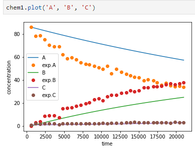
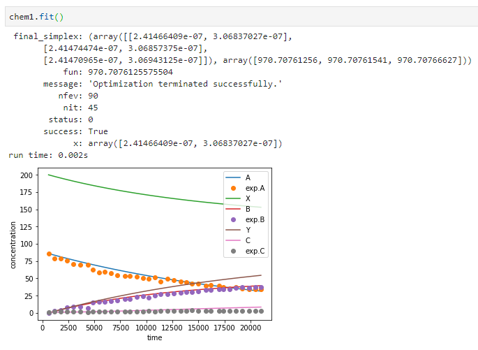
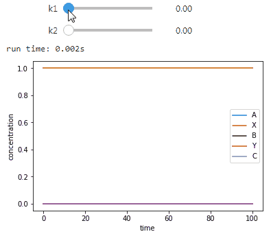

# Reaction Engineering and Catalytic Technology (REaCT)
Modelling and experimental data integration for selected chemical problems.

## Modelling and experimental data:

## Curve fitting chemical model:

## Real-time model manipulation example:

